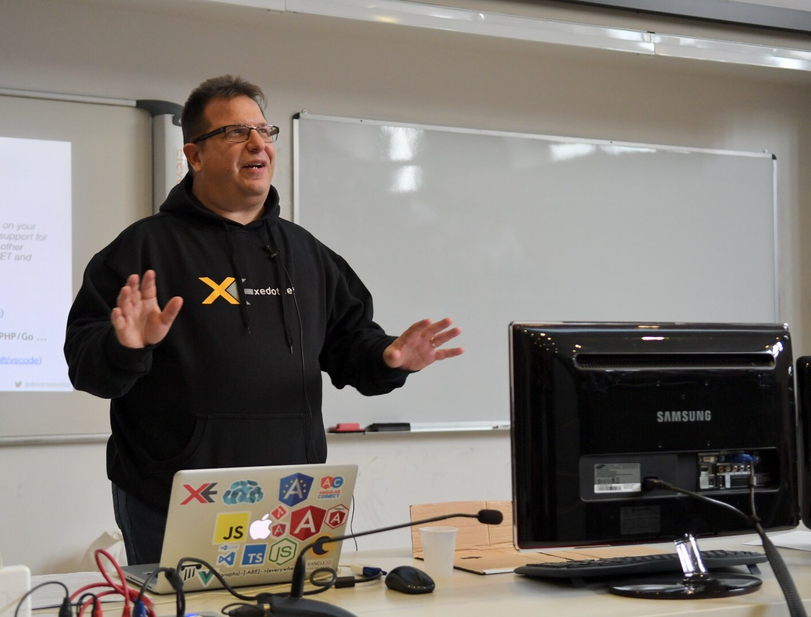
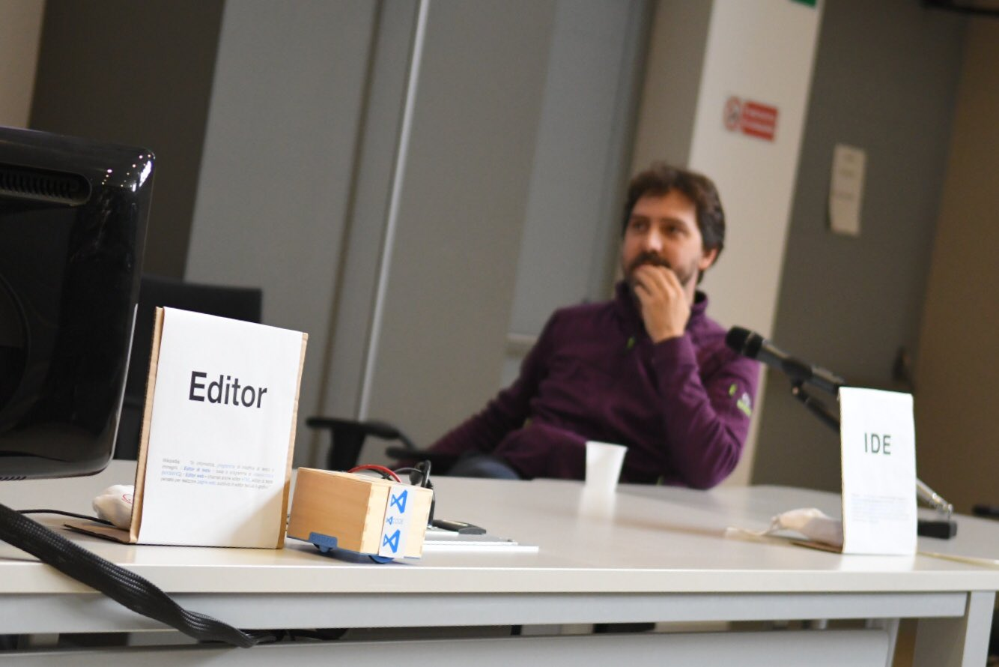
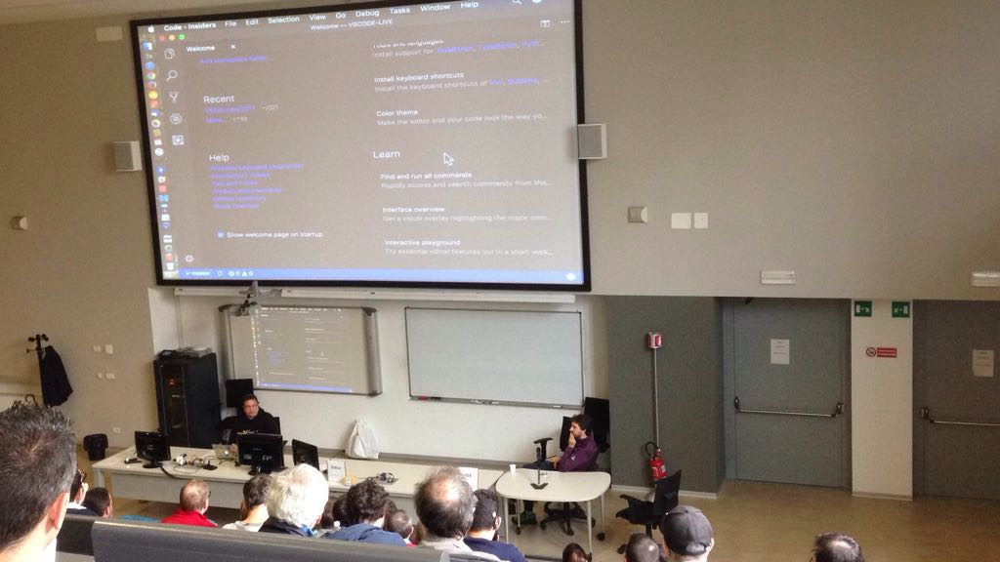
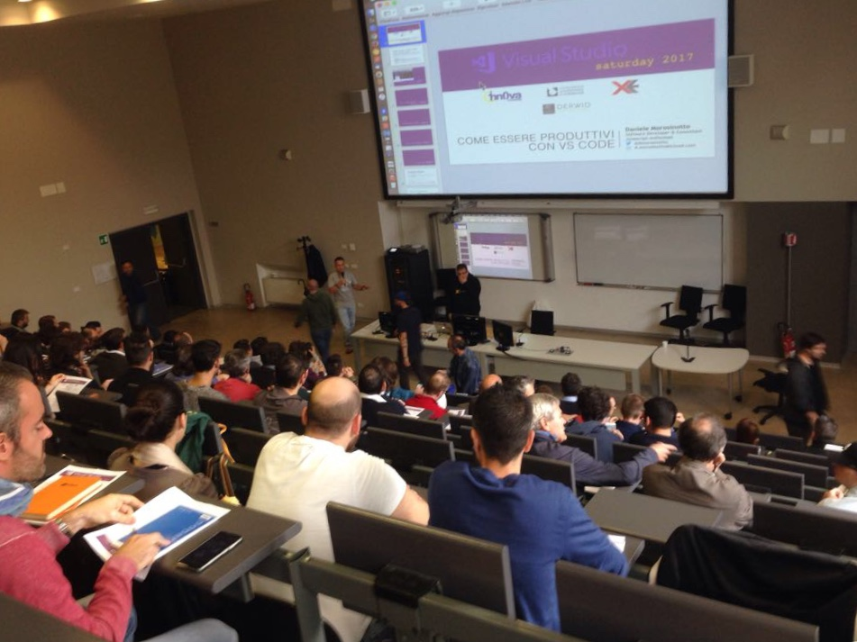
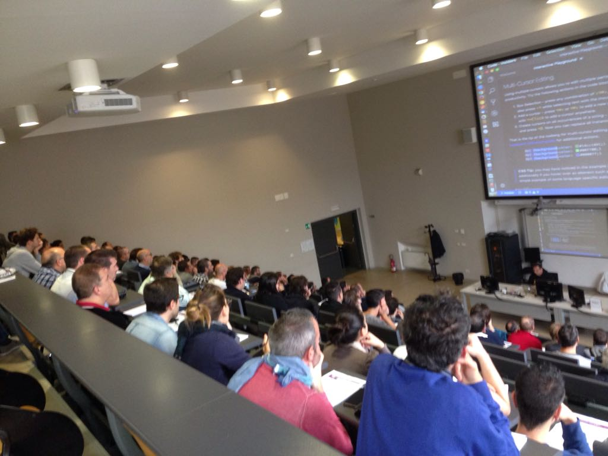
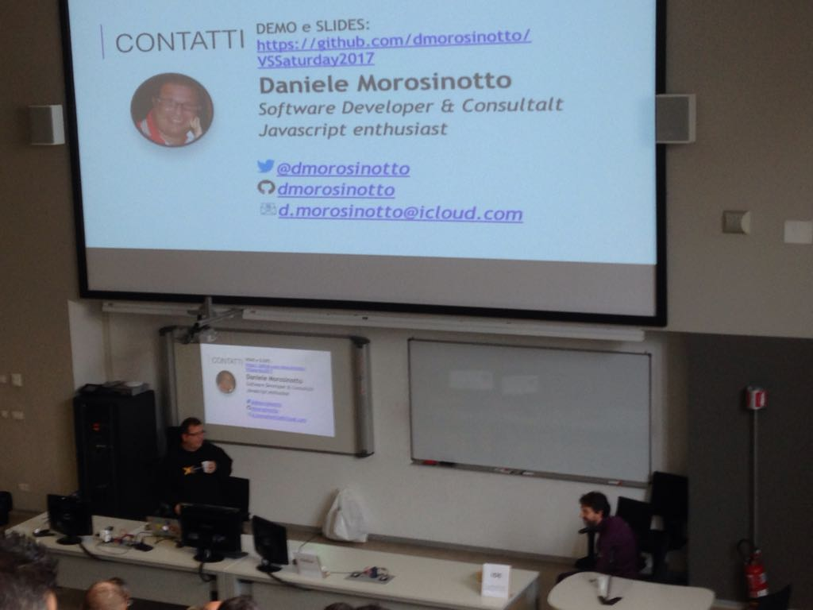

# COME ESSERE PRODUTTIVI CON [VSCODE](https://code.visualstudio.com)

[Slides](VS2017_Saturday.pdf) and Demo of MY Session: **COME ESSERE PRODUTTIVI CON VSCODE** - VSSaturday 21 Oct 2017

## VIDEO LIVE SESSION (Ita) [https://youtu.be/OyoJcj2pNYo](https://youtu.be/OyoJcj2pNYo)

### Kudos to [Marco](https://twitter.com/marcobortolin) for great photos!

ME start presenting VSCODE on my Mac, and ... | [Davide](https://twitter.com/davidecontin) helping w/[Cubetto](https://www.primotoys.com) -Q: VSCODE Editor or IDE?
:---: | :---: 
 | 

 Thanks | to **EVERYONE** | who partecipated | to my session. 
:---: | :---: | :---: | :---: 
 |  |  | 
